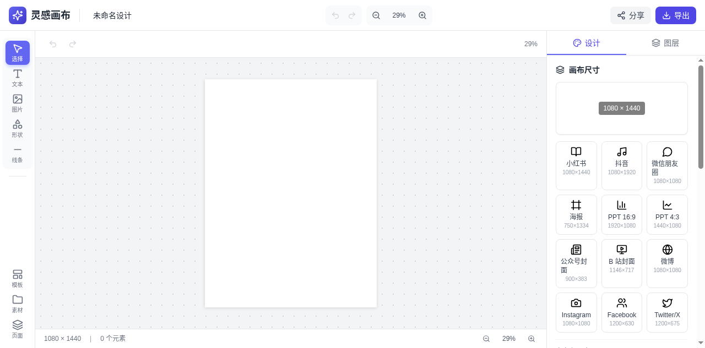
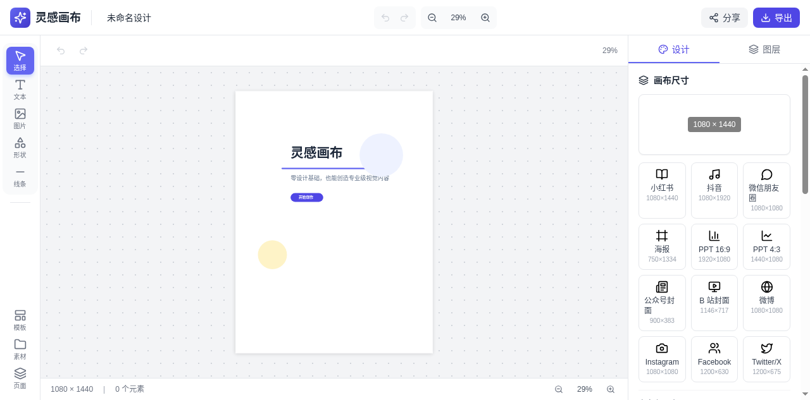
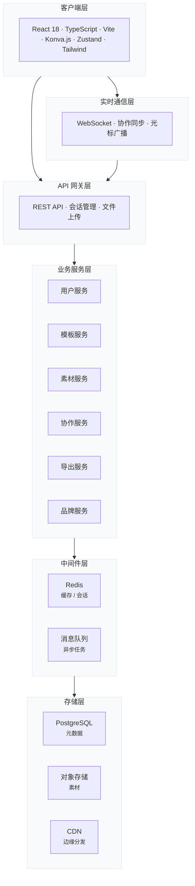

<div align="center">

  <a href="https://github.com/openforge-teams/inspiration-canvas">
    
  </a>

  <p></p>

  **零设计基础，也能创造专业级视觉内容**

  <p></p>

  [](https://react.dev/)
  [](https://www.typescriptlang.org/)
  [](https://konvajs.org/)
  [](https://nodejs.org/)
  [](https://vitejs.dev/)

  <p></p>

  [](LICENSE)
  [](https://github.com/openforge-teams/inspiration-canvas/issues)
  [](https://github.com/openforge-teams/inspiration-canvas/stargazers)
  [](https://github.com/openforge-teams/inspiration-canvas/commits)

</div>

---

## 产品预览

<p align="center">
  <strong>所见即所得的专业级设计体验</strong>
</p>

<table>
  <tr>
    <td width="50%">
      <p align="center"><strong>整洁的编辑界面</strong></p>
      <a href="docs/screenshots/main-interface.png">
        
      </a>
    </td>
    <td width="50%">
      <p align="center"><strong>自由的创作体验</strong></p>
      <a href="docs/screenshots/editing-interface.png">
        
      </a>
    </td>
  </tr>
</table>

---

## 产品理念

灵感画布不是另一个 Photoshop。它是为非设计人员打造的创作引擎——把设计决策拆解为**模板 + 素材 + 编辑器**三段式，让每个人都能在 5 分钟内产出专业级视觉内容。

> 设计不是专业人士的特权，而是每个人表达想法的工具。

---

## 核心能力

<table>
  <tr>
    <td width="25%" align="center">
      <strong>画布引擎</strong><br/><br/>
      基于 Konva.js 的高性能矢量渲染，60fps 流畅交互，支持视口裁剪与智能参考线
    </td>
    <td width="25%" align="center">
      <strong>多元素支持</strong><br/><br/>
      文本、图片、形状、线条、图标……所见即所得，非破坏性编辑
    </td>
    <td width="25%" align="center">
      <strong>模板系统</strong><br/><br/>
      参数化模板引擎，一键套用小红书、PPT、海报、简历等 20+ 尺寸预设
    </td>
    <td width="25%" align="center">
      <strong>实时协作</strong><br/><br/>
      WebSocket + CRDT，多人同时编辑，光标同步，操作回溯
    </td>
  </tr>
  <tr>
    <td align="center">
      <strong>多格式导出</strong><br/><br/>
      PNG / JPG / PDF / SVG，支持透明背景、高清缩放、CMYK 色彩空间
    </td>
    <td align="center">
      <strong>图层管理</strong><br/><br/>
      分组、锁定、排序、可见性切换，复杂设计也井然有序
    </td>
    <td align="center">
      <strong>历史回溯</strong><br/><br/>
      无限撤销/重做，每一步操作都可追溯
    </td>
    <td align="center">
      <strong>品牌中心</strong><br/><br/>
      锁定品牌色值、字体、Logo，团队输出视觉统一
    </td>
  </tr>
</table>

---

## 技术架构



### 技术选型

| 层级 | 技术 | 说明 |
|------|------|------|
| 前端框架 | **React 18** | 并发特性、自动批处理 |
| 语言 | **TypeScript 5** | 全链路类型安全 |
| 构建工具 | **Vite 5** | 秒级冷启动、HMR |
| 图形引擎 | **Konva.js** | 2D Canvas 高性能渲染 |
| 状态管理 | **Zustand** | 极简、可预测、可时间旅行 |
| 样式方案 | **Tailwind CSS** | 原子化 CSS，设计系统驱动 |
| 后端 | **Node.js + Express** | 高并发协作服务 |
| 实时通信 | **WebSocket + Yjs** | CRDT 冲突解决 |
| 数据库 | **PostgreSQL + Redis** | 持久化 + 缓存层 |
| 包管理 | **pnpm** | Monorepo 高效依赖管理 |

---

## 快速开始

### 环境要求

- Node.js ≥ 18
- pnpm ≥ 8

### 安装与运行

```bash
# 克隆仓库
git clone https://github.com/openforge-teams/inspiration-canvas.git
cd inspiration-canvas

# 安装依赖
pnpm install

# 启动开发服务（前端 + 后端并行）
pnpm dev

# 或分别启动
pnpm dev:web      # 前端: http://localhost:5173
pnpm dev:server   # 后端: http://localhost:3001
```

### 构建生产版本

```bash
# 构建所有包
pnpm build

# 仅构建前端
pnpm build:web

# 仅构建后端
pnpm build:server

# 启动生产服务
pnpm start
```

---

## 项目结构

```
inspiration-canvas/
├── apps/
│   ├── web/                 # 前端应用 (React + TS + Konva)
│   │   ├── src/
│   │   │   ├── components/
│   │   │   │   ├── canvas/  # 画布引擎 & 元素渲染
│   │   │   │   ├── layout/  # 页面布局
│   │   │   │   ├── panels/  # 属性面板
│   │   │   │   ├── common/  # 通用组件
│   │   │   │   └── modals/  # 弹窗组件
│   │   │   ├── store/        # Zustand 状态管理
│   │   │   ├── data/         # 模板 & 素材数据
│   │   │   ├── App.tsx
│   │   │   └── main.tsx
│   │   └── package.json
│   └── server/              # 后端服务 (Node.js + Express + WebSocket)
│       └── src/
│           ├── index.ts      # 服务入口 & 路由
│           └── types.ts      # 消息协议类型
├── packages/
│   └── shared/              # 共享类型 & 工具函数
│       └── src/
│           └── index.ts      # 元素工厂 & 文档模型 & 类型定义
├── package.json
├── pnpm-workspace.yaml
├── tsconfig.base.json
└── README.md
```

---

## 路线图

| 阶段 | 时间 | 里程碑 |
|------|------|--------|
| **Phase 0** | Month 1–3 | 基础编辑器：画布引擎、元素系统、单人编辑、本地持久化、基础导出 |
| **Phase 1** | Month 3–5 | 模板与素材：参数化模板引擎、语义检索、多尺寸适配、品牌中心 MVP |
| **Phase 2** | Month 5–8 | 实时协作：WebSocket 服务、CRDT 冲突解决、光标同步、评论、版本管理 |
| **Phase 3** | Month 8–12 | AI 能力：AI 生图 / 文案、魔法消除、智能抠图、对话式设计助手 |
| **Phase 4** | Month 12+ | 平台化：开放 API、供稿人生态、企业 SSO、多端客户端 (Desktop/Mobile) |

---

## 贡献指南

欢迎贡献代码。提交 PR 前请确保：

1. 代码通过 TypeScript 类型检查
2. 遵循现有代码风格
3. 提供必要的注释与文档

---

## 许可证

MIT License — 详见 [LICENSE](LICENSE) 文件。

---

<div align="center">

**Crafted with care for every creator.**

[Website](http://localhost:5173) · [Issues](https://github.com/openforge-teams/inspiration-canvas/issues) · [GitHub](https://github.com/openforge-teams/inspiration-canvas)

</div>
